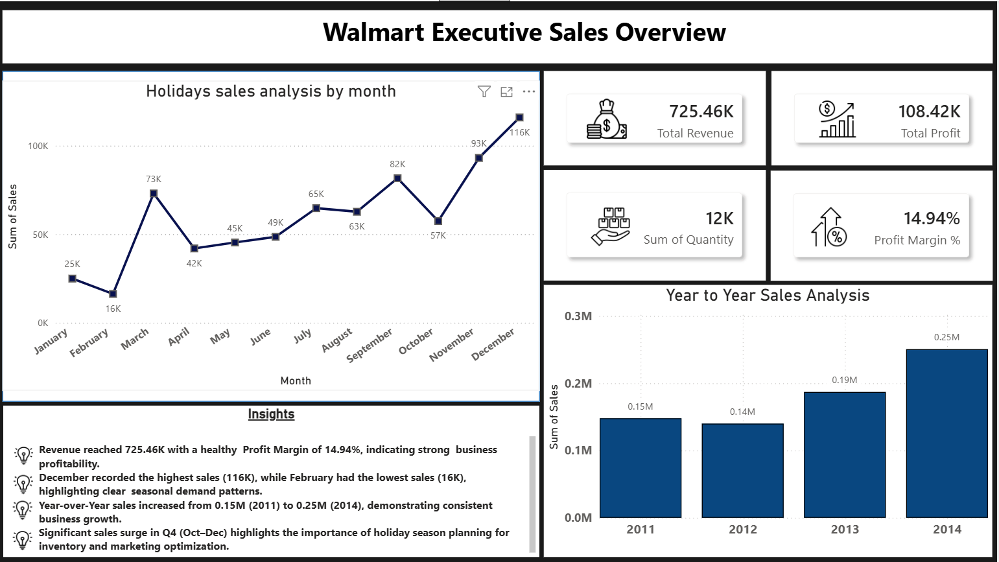
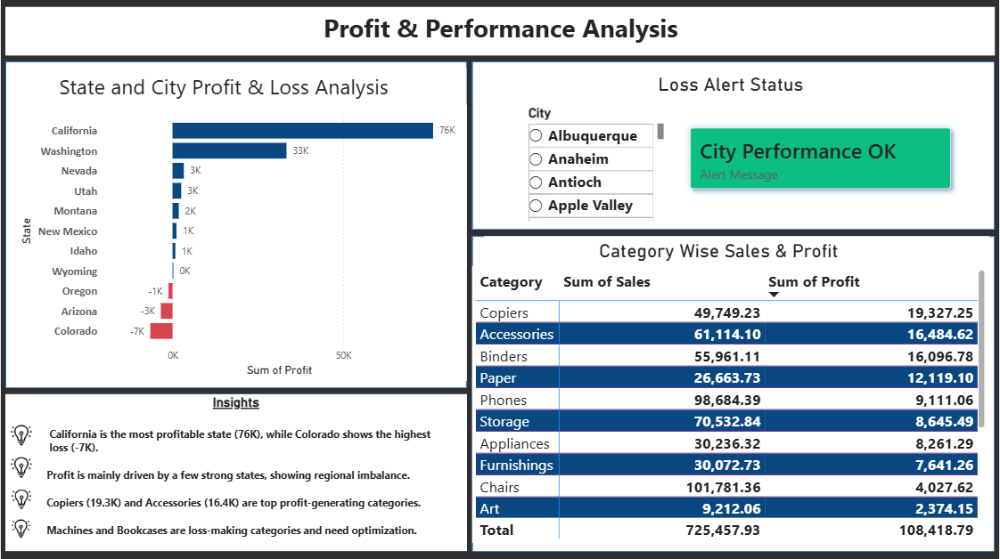
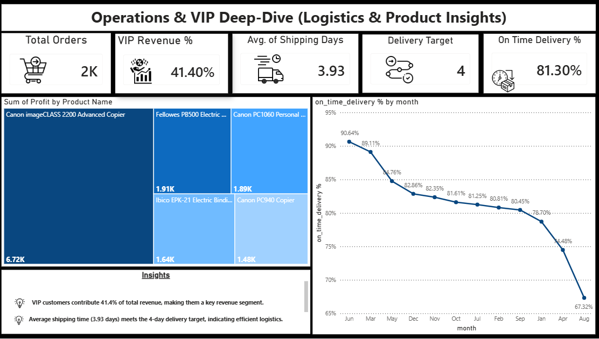

# 🛒 Walmart Sales Analysis

An end-to-end **Data Analytics** project that analyzes Walmart sales data using **Python, PostgreSQL, and Power BI** to uncover business insights and support data-driven decision-making.

---

## 📌 Project Overview

This project demonstrates the complete data analytics workflow, including data cleaning, exploratory data analysis (EDA), SQL-based business analysis, and interactive dashboard development.

The objective is to identify sales trends, profitability, customer behavior, and regional performance through meaningful visualizations and business insights.

---

## 🎯 Project Objectives

- Clean and preprocess raw sales data
- Perform Exploratory Data Analysis (EDA)
- Answer business questions using SQL
- Build an interactive Power BI dashboard
- Generate actionable business insights

---

## 🛠️ Tech Stack

- Python
- Pandas
- NumPy
- Matplotlib
- Seaborn
- PostgreSQL
- Power BI
- Git & GitHub

---

## 📊 SQL Business Analysis

The following business questions were solved using PostgreSQL:

- Total Sales & Profit by Category
- Year-over-Year Sales Trend
- Monthly Sales Trend
- Top Profitable States
- Loss-Making Cities
- Top Profitable Products
- Average Delivery Time by Category
- High-Value Orders Analysis
- Profitability Classification using `CASE WHEN`

---

## 📈 Power BI Dashboard

The dashboard provides interactive analysis of:

- Revenue, Profit & Profit Margin
- Sales Trends
- Category Performance
- State-wise Performance
- Product Performance
- Interactive Filters & Slicers

---

## 💡 Key Business Insights

- Identified top-performing states based on profitability.
- Detected loss-making cities requiring business attention.
- Compared category-wise sales and profit performance.
- Analyzed monthly and yearly sales trends.
- Identified the most profitable products.
- Evaluated delivery performance across product categories.

---

## 📂 Project Structure

```text
walmart-sales-analysis/
│
├── dataset/
├── notebook/
├── sql/
├── dashboard/
├── images/
└── README.md
```

---

## 🚀 Skills Demonstrated

- Data Cleaning
- Exploratory Data Analysis (EDA)
- SQL Query Writing
- Business Analytics
- Data Visualization
- Dashboard Development
- Git & GitHub

---

## 📷 Dashboard Preview

## 📊 Power BI Dashboard

### Page 1


### Page 2


### Page 3


---

## 🔮 Future Enhancements

- Deploy the project using Streamlit
- Add sales forecasting
- Connect to real-time datasets